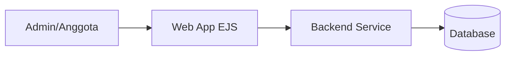

# Manajemen Piket Asrama

Manajemen Piket Asrama adalah aplikasi web fullstack yang dirancang untuk membantu pengelolaan jadwal piket asrama secara terstruktur, transparan, dan efisien. Aplikasi ini memudahkan pengurus maupun penghuni asrama dalam menyusun, membagikan, serta memantau pelaksanaan tugas piket harian maupun mingguan.

## Gambaran Proyek

Fungsi utama aplikasi:

- Login admin
- Manajemen orang (penghuni)
- Manajemen tempat
- Manajemen jadwal piket sekarang
- Historis piket
- Generate jadwal piket
- Rekap jadwal ke historis

## Tech Stack

- Backend: Express + TypeScript
- Frontend: EJS + Bootstrap + JavaScript
- Database: MongoDB (Mongoose)
- Testing: Jest

## Arsitektur Umum



## Struktur Utama

- `src/apps/api/` endpoint API dan logic per fitur
- `src/models/` model data
- `src/routes/` routing API dan views
- `views/` template EJS untuk frontend admin dan halaman publik
- `public/` asset frontend (CSS, JS, gambar)
- `tests/` pengujian dengan Jest

## Alur Singkat

1. Admin login dari halaman `/login-admin`.
2. Admin mengelola data lewat dashboard (`/dashboard-admin`).
3. Admin bisa generate jadwal lewat endpoint/task yang tersedia.
4. Data jadwal aktif disimpan di piket sekarang.
5. Rekap memindahkan data jadwal ke historis.

## Setup Lokal

1. Install dependency:

```bash
npm install
```

2. Siapkan environment variable:

- Untuk local cepat, file `.env` sudah disediakan.
- Untuk environment lain, copy dari `.env.example` lalu isi nilainya.

Variable minimum yang wajib ada:

- `JWT_SECRET`
- `COOKIE_SECRET`
- `MONGODB_URI`

Contoh local MongoDB:

```bash
mongodb://127.0.0.1:27017/manajemen_piket
```

3. Jalankan development server:

```bash
npm run dev
```

4. Build dan test:

```bash
npm run build
npm test
```

## Scripts

- `npm run dev` menjalankan server development dengan `nodemon` + `ts-node`
- `npm run build` compile TypeScript ke folder `dist`
- `npm run start:prod` menjalankan hasil build dari `dist/server.js`
- `npm test` menjalankan test Jest
- `npm run seed:admin` membuat akun admin awal (default: `admin` / `Admin@123`)

Untuk mengubah credential seed admin, set env berikut sebelum menjalankan script:

- `ADMIN_SEED_USERNAME`
- `ADMIN_SEED_PASSWORD`
